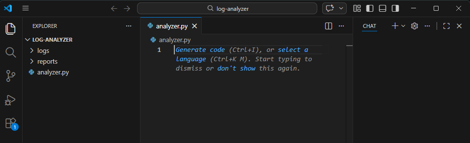
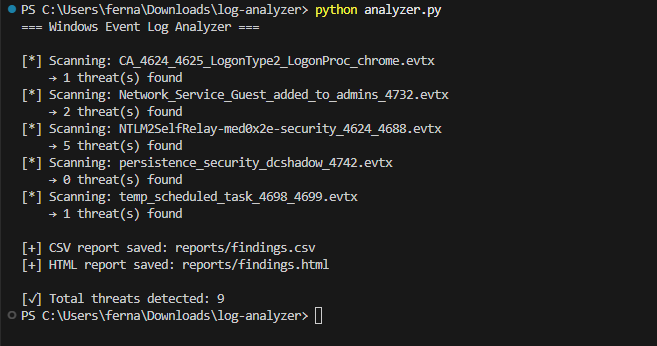
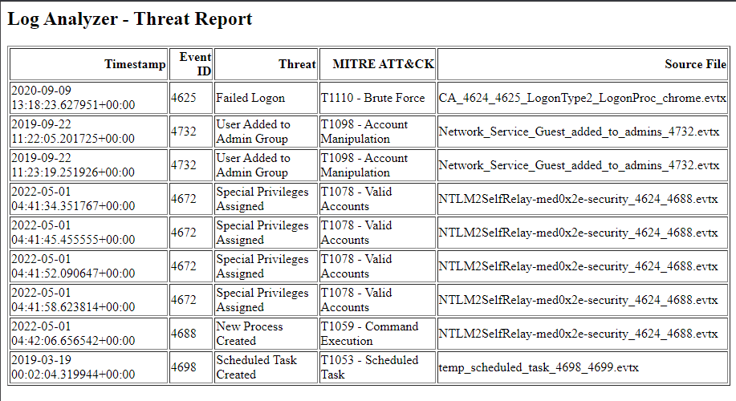

# 🔍 Windows Event Log Analyzer

A Python-based threat detection tool that parses Windows Event Log (`.evtx`) files, identifies suspicious activity, and generates structured reports mapped to the **MITRE ATT&CK framework**.

---

## 📌 Project Overview

This tool was built to simulate the kind of log analysis performed by SOC analysts during incident investigations. It automates the process of scanning Windows event logs for known threat indicators and produces actionable reports in both CSV and HTML formats.

---

## 🛠️ Tools & Technologies

| Tool | Purpose |
|------|---------|
| Python 3 | Core scripting language |
| python-evtx | Parse Windows `.evtx` log files |
| pandas | Data manipulation and report generation |
| XML / ElementTree | Extract event fields from log records |
| MITRE ATT&CK | Threat classification framework |

---

## 🚨 Threat Detection Coverage

The analyzer detects the following Windows Event IDs mapped to MITRE ATT&CK techniques:

| Event ID | Threat | MITRE ATT&CK |
|----------|--------|--------------|
| 4625 | Failed Logon | T1110 - Brute Force |
| 4648 | Logon with Explicit Credentials | T1550 - Use Alternate Auth |
| 4672 | Special Privileges Assigned | T1078 - Valid Accounts |
| 4688 | New Process Created | T1059 - Command Execution |
| 4698 | Scheduled Task Created | T1053 - Scheduled Task |
| 4720 | User Account Created | T1136 - Create Account |
| 4732 | User Added to Admin Group | T1098 - Account Manipulation |
| 4776 | Credential Validation | T1003 - Credential Dumping |
| 7045 | New Service Installed | T1543 - Create/Modify Service |

---

## 📁 Project Structure

```
log-analyzer/
├── logs/               # Input .evtx log files
├── reports/
│   ├── findings.csv    # CSV threat report
│   └── findings.html   # HTML threat report
└── analyzer.py         # Main detection script
```

---

## ⚙️ Installation

**Requirements:** Python 3.x

```bash
pip install python-evtx pandas jinja2
```

---

## 🚀 Usage

1. Place `.evtx` log files into the `logs/` folder
2. Run the analyzer:

```bash
python analyzer.py
```

3. Reports are automatically saved to the `reports/` folder

---

## 📊 Sample Output

```
=== Windows Event Log Analyzer ===

[*] Scanning: CA_4624_4625_LogonType2_LogonProc_chrome.evtx
    → 1 threat(s) found
[*] Scanning: Network_Service_Guest_added_to_admins_4732.evtx
    → 2 threat(s) found
[*] Scanning: NTLM2SelfRelay-med0x2e-security_4624_4688.evtx
    → 5 threat(s) found
[*] Scanning: temp_scheduled_task_4698_4699.evtx
    → 1 threat(s) found

[+] CSV report saved: reports/findings.csv
[+] HTML report saved: reports/findings.html
[✓] Total threats detected: 9
```

---

## 🔎 Sample Findings

| Timestamp | Event ID | Threat | MITRE ATT&CK | Source File |
|-----------|----------|--------|--------------|-------------|
| 2020-09-09 13:18:23 | 4625 | Failed Logon | T1110 - Brute Force | CA_4624_4625... |
| 2019-09-22 11:22:05 | 4732 | User Added to Admin Group | T1098 - Account Manipulation | Network_Service... |
| 2022-05-01 04:41:34 | 4672 | Special Privileges Assigned | T1078 - Valid Accounts | NTLM2SelfRelay... |
| 2022-05-01 04:42:06 | 4688 | New Process Created | T1059 - Command Execution | NTLM2SelfRelay... |
| 2019-03-19 00:02:04 | 4698 | Scheduled Task Created | T1053 - Scheduled Task | temp_scheduled... |

---

## 📸 Screenshots

> *Add your screenshots here after uploading them to your repo*

### Project Setup


### Script Running


### HTML Report


---

## 🎯 Skills Demonstrated

- Windows Event Log analysis
- Threat detection logic using known IOCs
- MITRE ATT&CK framework mapping
- Python scripting for security automation
- Report generation (CSV + HTML)
- Log parsing from real-world attack samples

---

## 📂 Log Samples Source

Sample `.evtx` files sourced from [EVTX-ATTACK-SAMPLES](https://github.com/sbousseaden/EVTX-ATTACK-SAMPLES) by sbousseaden — a public repository of real-world attack log samples used for security research and detection engineering.

---

## 👤 Author

**cpt-ferna02**  
Cyber Information Assurance Student  
[GitHub](https://github.com/cpt-ferna02)
